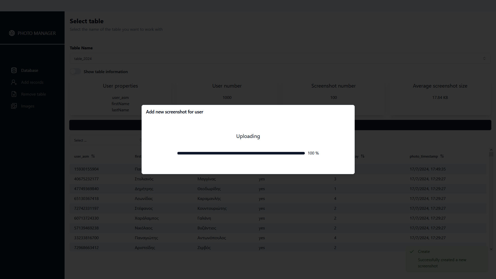

# Photo Application

## Description

This project aims to work as a manager for creating photos for ID cards for lots of people. The project is fully functional but incomplete. More functionality is going to be added in the future. Also unit tests for UI using Vitest will be added.

## Frontend Technologies and libraries

- Typescript
- React
- TailwindCSS
- Tanstack React-Query
- Tanstack React-Table
- Tanstack React-Virtual
- Zustand
- Zod
- React-Image-Crop

## Backend Technologies and libraries

- Node.js
- Express
- SQLite
- Jest
- Zod

Below you can see some screenshots from the UI

